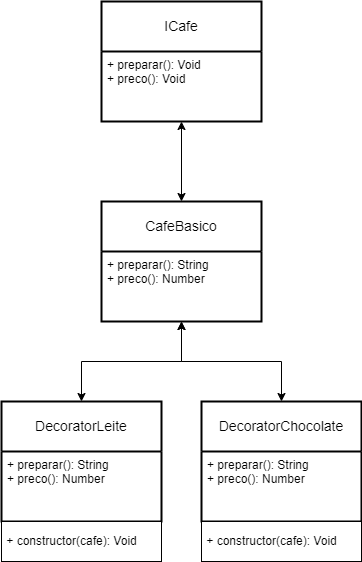

# DesignPattern-Decorator

<p>Decorator é um padrão de design estrutural que permite que você envolva um objeto com outros objetos, chamados de decorators, que fornecem funcionalidades adicionais, sem alterar a estrutura do próprio objeto.</p>
<p>O Decorator é útil quando você precisa adicionar comportamentos a objetos de forma flexível e modular, sem criar subclasses para cada combinação possível de funcionalidades.<br/>
Isso promove um dos princípio SOLID, o 'Open-Closed', que diz: "Entidades de software devem estar aberto para extensão, mas fechado para modificação", pois você pode adicionar novos comportamentos sem alterar o código fonte.</p>
<h2>Diagrama de Classe</h2>

<br/>
<h2>Exemplo Decorator</h2>

```js
// Interface para o café básico e decoradores
class InterfaceCafe {
    preparar() {}
    preco() {}
}

// Classe Base
class CafeBasico extends InterfaceCafe {
    preparar() {
        return 'Café simples';
    }

    preco() {
        return 5.0;
    }
}

// Decorator que adiciona leite ao café
class DecoratorLeite extends InterfaceCafe {
    constructor(cafe) {
        super()
        this.cafe = cafe;
    }

    preparar() {
        return this.cafe.preparar() + ', com leite';
    }

    preco() {
        return this.cafe.preco() + 2.5;
    }
}

// Decorator que adiciona chocolate ao café
class DecoratorChocolate extends InterfaceCafe {
    constructor(cafe) {
        super()
        this.cafe = cafe;
    }

    preparar() {
        return this.cafe.preparar() + ', com chocolate';
    }

    preco() {
        return this.cafe.preco() + 3.0;
    }
}

let meuCafe = new CafeBasico();
console.log(`Tipo: ${meuCafe.preparar()} | Preço: R$${meuCafe.preco().toFixed(2)}`);

meuCafe = new DecoratorLeite(meuCafe);
console.log(`Tipo: ${meuCafe.preparar()} | Preço: R$${meuCafe.preco().toFixed(2)}`);

meuCafe = new DecoratorChocolate(meuCafe);
console.log(`Tipo: ${meuCafe.preparar()} | Preço: R$${meuCafe.preco().toFixed(2)}`);
```